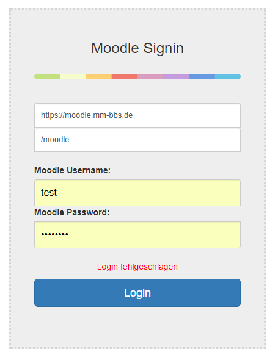

# MMBbS Alexa Skill

Melden Sie sich mit ihren Zugangsdaten am System an.

Sie starten den Skill mit "Alexa starte Schule"!

Anschließend können Sie Alexa fragen:
- "Wie sind meine Aufgaben"
- "Wie sind meine Kurse"
- "Habe ich neue Nachrichten"
- "Wie ist die Telefonnummer"
- "Wie ist die Adresse"
- "Wie ist der Name meines Lieblingslehrer" ;-)

